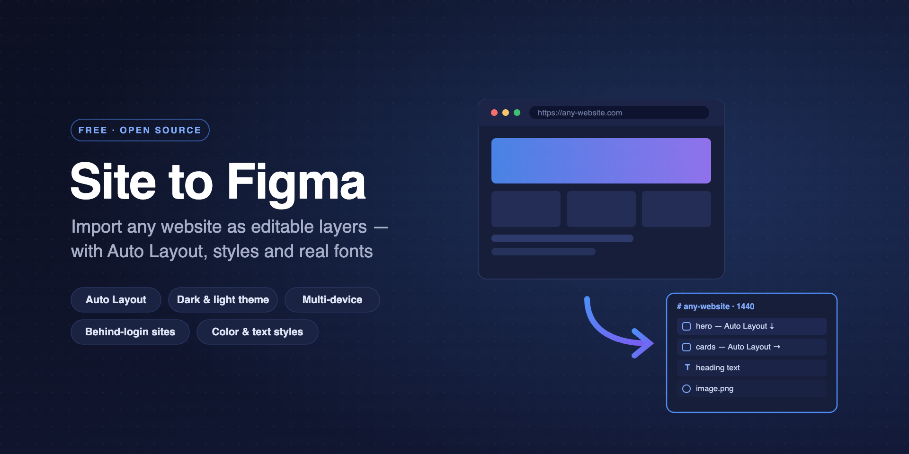

# Website to Figma

**Import any website into editable Figma layers.** Paste a URL and get frames, text,
images, SVG vectors and Auto Layout — not a screenshot. A free website-to-Figma /
HTML-to-Figma importer with a renderer you can run yourself.

[Что это, по-русски →](#по-русски)



---

## What it does

A page comes back as layers you can edit:

- **Auto Layout.** Flex containers arrive as real auto-layout frames with gap, padding
  and alignment. Every layout is checked against the element's actual coordinates first —
  where it does not hold up, the layer keeps its exact absolute position instead of a
  plausible-looking wrong one.
- **A whole site, not one page.** The plugin reads the sitemap, or crawls internal links
  when there is none, and lists every page it found. Tick the ones you want; each lands
  in its own row of frames.
- **Several widths at once.** 1440, 1280, 768, 390, or a width you type. Variants import
  side by side.
- **Light and dark.** `prefers-color-scheme` is emulated, so both themes can come in one run.
- **Styles.** Figma color and text styles built from the site's own palette and typography.
- **A reference screenshot,** locked, beside the import, for checking pixel by pixel.
- **Sites behind a login.** A real Chrome window opens — sign in, navigate, then import
  the page you are looking at, session and all.

Text keeps its font, size, weight, line height and alignment; a missing font falls back to
the nearest match, then Inter. `webp` and `avif` are converted on the way in, SVG icons
(including `<use>` sprites) come across as vectors, and lazy images are scrolled into view
before capture.

## Install

**The plugin.** Figma **desktop** → **Plugins → Development → Import plugin from
manifest…** → pick `plugin/manifest.json`. (Local plugins only import in the desktop app.)

**The renderer.** Right now the plugin talks to a renderer on your own machine, so set
one up first. Once the plugin lands in the Figma Community it will point at a shared
renderer by default, and running your own becomes the option you pick for sites behind
a login or for no rate limit at all.

macOS — double-click **`mac/install.command`**. It checks Node, installs what is missing,
and registers the renderer as a background service that starts with your session. No
terminal window to keep open. Details in [mac/README.md](mac/README.md).

Anywhere else:

```bash
cd figma-site-importer/server
npm install        # first run only
npm start
```

Needs Node.js 18+ and Google Chrome — or run `npx playwright install chromium` once.

Then point the plugin at it: **Advanced → Server address**.

## Use

Paste a link, pick widths and options, hit **Import**. Each variant (width × theme)
becomes its own frame, laid out side by side.

For several pages at once, press **Pages** next to the link field. The plugin finds the
site's pages and lists them with titles — filter, tick, import. They go one after another,
each in its own row. The estimate at the bottom of the list is worth a look before you
tick two hundred pages: one page takes roughly 25 seconds.

## What it will not do

- Auto Layout covers flex containers. Grid and ordinary block layouts stay on absolute
  coordinates — accurate, just not auto-laid-out.
- Animations, hover states and iframe contents do not come across.
- Icon fonts (Font Awesome and friends) are skipped when the font is not installed.
- Dark theme works on sites that respect `prefers-color-scheme`. When a site switches
  theme with its own button, use the behind-a-login mode and flip it in the browser
  that opens.
- Complex CSS — `filter`, `blend-mode`, `clip-path`, `conic-gradient` — is simplified.

## When something breaks

| What you see | What to do |
| --- | --- |
| Red dot, "server offline" | Double-click `mac/install.command`, or `npm start` in `server/` |
| Port 4511 is taken | `PORT=4512 npm start`, then change the address in Advanced |
| "Could not launch a browser" | `npx playwright install chromium` in `server/` |
| Page cut off at the bottom | Raise **Max height** in Advanced |
| Cloudflare or a captcha blocks it | Turn on **Site behind a login**, pass the check in the window that opens |
| Layers shifted after Auto Layout | Turn Auto Layout off — the import goes pixel by pixel instead |
| **Pages** found too few | The site has no sitemap and the crawl only goes two levels deep. Paste the page you need and import it on its own |
| **Pages** found too much | The list shows everything in the sitemap. Filter by address, then hit **All** — it selects only what the filter left |

## How it works

```
Figma plugin (ui.html) ──HTTP──▶ renderer (Node + Playwright + Chrome)
        ▲                              │ opens the page, headless or in a window,
        │  JSON: layer tree,           │ scrolls it, reads getComputedStyle,
        │  flex layouts, text,         │ works out flex layouts,
        │  styles, images, screenshot  │ downloads images, crops the screenshot
        └── code.js builds frames, applies Auto Layout, creates styles
```

`server/` opens the page and reads it. `plugin/` asks for a URL and builds the layers.
Nothing leaves your machine when you run the renderer yourself.

## Support the project

Free, no accounts, no import quota. If it saved you an afternoon:

**USDT on the TON network only**

```
UQBz8oG02Va5OnCUw5mZ7sIUhxcqqWrTwIDlMqqt8Ca0jWbL
```

> ⚠️ **USDT on TON only.** USDT TRC20 (Tron), ERC20 or any other network or coin sent
> to this address is lost.

The same address is behind the **Support** button at the bottom of the plugin.

## License

Source available, not open source. Read it, run it, modify it for yourself, host it for
your own team — but do not republish it to the Figma Community or any other marketplace.
Full terms in [LICENSE](LICENSE).

---

## По-русски

**Website to Figma** переносит любой сайт по ссылке в редактируемые слои Figma:
фреймы, тексты, картинки, векторы, Auto Layout и стили. Как перенести сайт в фигму —
вставить ссылку и нажать «Импортировать».

Бесплатно и без ограничений на количество импортов. Умеет то, за что аналоги берут
деньги: Auto Layout, импорт всех страниц сайта пакетом, несколько устройств за раз,
тёмную тему, вход на сайты за логином и скриншот-эталон для сверки.

Состоит из двух частей:

- **`server/`** — сервер рендеринга. Открывает страницу в настоящем Chrome через
  Playwright, снимает вычисленные стили, координаты, тексты и картинки. Он же ищет
  страницы сайта для пакетного импорта. На вашей машине не отправляет никуда ничего.
- **`plugin/`** — плагин Figma. Спрашивает ссылку, получает данные и строит слои.

**Установка сервера на macOS:** двойной клик по `mac/install.command` — дальше он
работает в фоне сам, терминал держать открытым не нужно.
Подробности в [mac/README.md](mac/README.md).

**Установка плагина:** Figma desktop → **Plugins → Development → Import plugin from
manifest…** → выбрать `plugin/manifest.json`.

Ограничения, разбор проблем и устройство — в английской части выше, разделы
[What it will not do](#what-it-will-not-do) и [When something breaks](#when-something-breaks).

Хотите опубликовать свою сборку в Community — нельзя, лицензия это запрещает.
Всё остальное можно.
